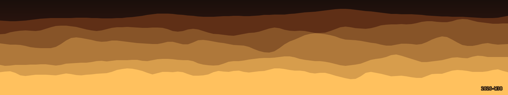
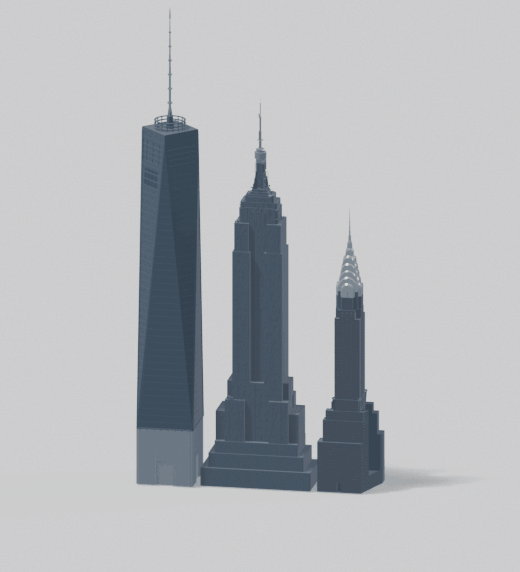

<table>
<tr>
<td width="50%" valign="top">

```
JEFFERY-PROD BIOS v2.0            (C) 2026
------------------------------------------
User ........ Jeffery Frederic
Role ........ Software engineer
Location .... New York City
Time zone ... Eastern (ET)

Stack ....... TypeScript, Astro, Python
System ...... Windows, macOS, Linux
Shell ....... PowerShell, Git Bash
```

</td>
<td width="50%" align="center">

<picture>
  <source media="(prefers-color-scheme: dark)" srcset="assets/skyline-dark.gif">
  
</picture>

</td>
</tr>
</table>
